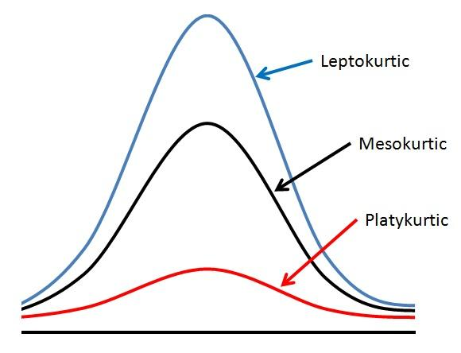

# Setup

```{r}
library(ggplot2) # plotting library

source("http://bit.ly/theme_pub") # Set custom plotting theme
theme_set(theme_pub())
```

# Central Moments

Central moments (CM) characterize the distribution. We've already seen two of these. 
Here are the first through 4th central moments:

  1. The 1st CM is the Mean: $\bar x = \frac{\sum(x_i)}{n}$
  2. The 2nd CM is the Variance: $\frac{\sum(x_i - \bar x)^2}{n-1}$ 
  3. The 3rd CM is the Skewness: $\frac{\sum(x_i - \bar x)^3}{n-1}$ 
  4. The 4th CM is the Kurtosis: $\frac{\sum(x_i - \bar x)^4}{n-1}$ 

## Coefficient of Skew

Notice that skew is like variance but with the third exponent, meaning that values 
can be negative or positive. If we have a few very small values (relative to the mean) 
then our skew will tend to be more negative. If we have a few very large values 
it will tend to be more positive. Skew will also increase with the variance of 
the distribution, so we often standardize using the standard deviation raised to 
the same exponent: 

$$ C_{Skew} = Skew/\sigma = \frac{\sum(x_i - \bar x)^3}{\sigma^3(n-1)}$$
A normal distribution will typically have a coefficient of skew near zero:

Negative $C_{Skew}$ values characterize distributions with **left skew**

Positive $C_{Skew}$ values characterize distributions with **right skew**

Values of $C_{Skew}$ near zero are symmetical (i.e. 'normal')


Skew examples from [Wikipedia](https://en.wikipedia.org/wiki/Skewness).

## Coefficient of Kurtosis

Kurtosis uses the 4th exponent, so all values will be positive, however outliers 
are weighted more heavily than values close to zero. As with skew, kurtosis will 
scale with the variance, so we usually look at the coefficient of kurtosis, 
standardized in an analogous way:

$$ C_{Kurt} = Kurt/\sigma = \frac{\sum(x_i - \bar x)^4}{\sigma^4(n-1)} -3$$
We subtract 3 because a normal distribution will typically have a coefficient of 
kurtosis near 3:

Positive $C_{Kurt}$ values characterize **Leptokurtic** distributions

Neative $C_{Kurt}$ values characterize **Platykurtic** distributions

Values of $C_{Kurt}$ near zero are **Mesokurtic** (i.e. 'normal')



# Handling non-normal data

Now that we know how to characterize non-normal distributions, let's look at 
a few examples and then see how we can handle these in our statistical models

## Examples of non-normal data

Let's look at a few examples, starting with a normal distribution for comparison:

```{r}
X<-NormDat<-rnorm(1000)
qplot(NormDat)
```

What if we raise each value to the exponent: $e^x$

```{r}
ExpDat<-exp(rnorm(1000))
qplot(ExpDat)
```

Or multiply two randomly chosen values: $x_i \times y_i$

```{r}
multNorm<-rnorm(1000)*rnorm(1000)
qplot(multNorm)
```

Or take the reciprocal: $1/x_i$

```{r}
invNorm<-1/rnorm(1000)
qplot(invNorm)
```

Let's try two more using different distributions that we know are not normal:

```{r}
BinDat<-rbinom(n=1000, size=5, prob=0.2)
qplot(BinDat)
```

```{r}
PoisDat<-rpois(n=1000, lambda=2)
qplot(PoisDat)
```


> EXERCISE: Calculate the standard deviation, skew and kurtosis coefficients 
for each figure

# Tranformations

The first thing we can try are data transformations. A transformation is just an 
equation that we apply to the data to try to make it look more normal. The 
log-transformation is very common and often useful. There is a good mathematical 
reason for this, if you remember that:

$$log(x*y) = log(x) + log(y)$$

So if our data are on an exponential (multiplicative) scale, then a 
log-transformation puts them on a linear (additive) scale

```{r}
qplot(log(ExpDat))
qplot(log(multNorm))
qplot(log(invNorm))
qplot(log(BinDat))
qplot(log(PoisDat))
```

We still have a bit of skew in a couple of these but overall this is a big 
improvement. Even with the skew the data are much closer to normal than without 
the transformation

```{r}
qplot(sqrt(ExpDat))
qplot(sqrt(multNorm))
qplot(sqrt(invNorm))
```

Other common transformations include square-root, arcsine.

# Non-parametric models

Another option is to use a non-parametric model that doesn't make assumptions 
about the distribution of the population. There are many examples of these, 
including those covered in another tutorial on [resampling and permutation](https://colauttilab.github.io/EcologyTutorials/bootstrap.html).

Permutation tests don't make any assumptions about the underlying distribution. 