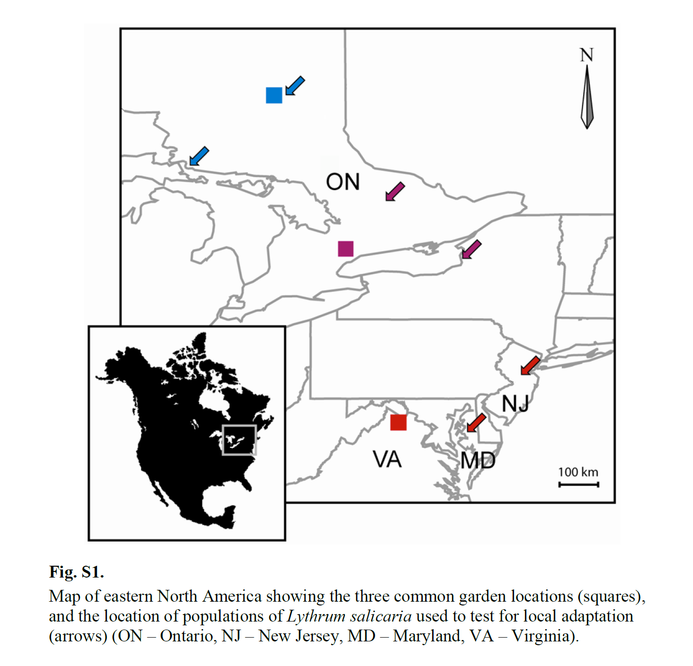

# Overview

You should now be familiar with [linear models (LM)](https://colauttilab.github.io/RIntroStats/3_LinearModels.html), [generalized linear models (GLM)](https://colauttilab.github.io/RIntroStats/6_GeneralizedLM.html) and [(generalized) linear mixed models (MM)](https://colauttilab.github.io/RIntroStats/8_MixedModels.html). 

You should be familiar with the similarities and differences so that you understand how GLM and MM expand on LM in different ways. In this tutorial we add another tool to the statistical toolbox. Generalized Additive Models (GAM) are an extension of polynomial regression but allowing more complex curves and interactions.

A general function for a GAM is:

$$g(Y) = \beta_0 + s_1(X_1) + ... + s_k(X_k) + \epsilon$$

The terms `g()` and `s()` denote functions or transformations of the data. The `g()` term we have seen before, this is the **link function** just like we saw with the generalized linear models. The link function just transforms the variable based on its error distribution (e.g. binomial, Poisson, Gaussian). The `s()` functions are **smoothing functions**.

The smoothing functions are estimated directly from the data, rather than fitting slopes like we do with standard linear regression. This involves some complex math that you won't need to know to apply and interpret GAM results, so we won't examine it here. Just remember that `s()` is some kind of function. The complexity of the smoothing function is given by a parameter $\lambda$. 

$\lambda$ is a parameter that is commonly used in machine learning models. For now, just know a higher $\lambda$ value produces a smoother curve.


# Setup

We'll be using the `mgcv` library for Generalized Additive Models (GAM) and Generalized Additive Mixed Models (GAMM):

```{r}
library(mgcv)
```


The usual setup for plotting, data management, and likelihood ratio test (for model selection)

```{r}
library(ggplot2) # plotting library
library(dplyr) # data management
library(lmtest)

source("http://bit.ly/theme_pub") # Set custom plotting theme
theme_set(theme_pub())
```

Import data from the 2013 Science Paper ["Rapid adaptation to climate facilitates range expansion of an invasive plant"](https://doi.org/10.1126/science.1242121).

```{r}
LythrumDat<-read.csv("https://colauttilab.github.io/Data/ColauttiBarrett2013Data.csv",header=T)
```

# Data Overview

This data is from a published paper, and it's availabe for free from the Dryad repository: [https://doi.org/10.5061/dryad.878m3](https://doi.org/10.5061/dryad.878m3)

The Dryad Repository [DataDryad.org](https://datadryad.org/) is a great place to find datasets to practice your analytical skills or to investigate new ideas.

Like most data in the repository, the dataset we will be working on is a bit more complicated than most of the examples we've used in most of the previous self-tutorials. So we'll take some time to understand the data before moving on. Full detail is available in the Science paper ["Colautti & Barrett (2013_"](https://doi.org/10.1126/science.1242121). But here we'll focus on a few aspects of the data.

The main question we'll look at today is: 

> **How does natural selection act on Flowering time?**

The paper reports on a **reciprocal transplant** experiment. This is a classic experimental design in which genotypes are collected from different geographic locations, and reared together in different environments. 

In this case, seeds were collected from different maternal 'families' along a latitudinal gradient, and then grown at 3 locations along the same gradient. This is a common approach for natural populations. Since two individuals from the same maternal family share somewhere between 1/4 (half-sib) to 1/2 (full-sib) of their genes in common, we can use statistical methods to estimate the effects of genetic similarity on phenotype. 

In this experiment, there were 4 growing seasons from 2007 to 2010. Traits measured in each year are Julian Day of first flower, height of the vegetative portion of the plant, inflorescence biomass and number of fruits. Genetic families were sampled from six locations and the entire experiment was replicated at three geographic locations along a latitudinal gradient: Timmons (ON), Newmarket (ON) and northern Virginia.

This map from the Supplementary Material of the paper shows the locations of the seed collections (arrows) and common garden locations (squares).



Looking at the structure of the data: 

```{r, eval=F}
str(LythrumDat)
```

  * **Ind** -- A unique identifier for each plant in the experiment
  * **Site** -- The common garden location: BEF = South, KSR = Mid, Timmins = North
  * **Row & Pos** -- location within the common garden
  * **Mat** -- A unique identifier for each maternal family
  * **Pop** -- The Population (seed location) in alphabetical order from North (A) to South (T)
  * **Region** -- The geographical region of the saampled population. There are 3 regions (North, Mid, South) with two populations from each region
  * **FlwrXX** -- Julian Day of first flower 
  * **FVegXX** -- Height of the vegetative part of the plant, measured on the day that the plant started to flower
  * **HVegXX** -- Height of the vegetative part of the plant, measured at the end (post-harvest)
  * **InfMassXX** -- Mass of the inflorescence, which previous studies show is a good estimate of total seeds production
  * **Fruits07** -- Number of fruits measured in 2007; can be used to test relationship between fruit number and inflorescence biomass.

NOTE: **XX** above is a 2-digit number that refers to year of collection from 2007 through 2010.

# Fitness

Fitness in this experiment can be measured as lifetime reproduction over the four growing seasons. For this we can simply sum the InfMassXX columns, but first we should replace NA with 0.

```{r}
SelDat<-LythrumDat %>%
  mutate(InfMass07 = ifelse(is.na(InfMass07),0,InfMass07),
         InfMass08 = ifelse(is.na(InfMass08),0,InfMass08),
         InfMass09 = ifelse(is.na(InfMass09),0,InfMass09),
         InfMass10 = ifelse(is.na(InfMass10),0,InfMass10)
         ) %>%
  mutate(Fitness = InfMass07 + InfMass08 + InfMass09 + InfMass10)
```

Now we can try to visualize the distribution of fitness. We should probably look at each site separately

```{r}
qplot(x=Fitness, facets="Site", data=SelDat)
```

# Phenotypes

The main traits under selection are flowering time and vegetative size. These are measured in each year but they are fairly correlated.

```{r}
qplot(x=Flwr08, y=Flwr09, data=SelDat)
```

To make the analysis easier, we can average the flowering time and size across years.

Before we can do this, we have to adjust the FlwrXX columns because the values here include the year of measurement. You can see this by looking at the values on the x vs y-axis and you can see that the values of y are advanced by about 365 days.

To standardize day within year, we'll take a shortcut, and just adjust each to the earliest value within each year.

```{r}
SelDat<-SelDat %>%
  mutate(Flwr07 = Flwr07 - min(Flwr07,na.rm=T),
         Flwr08 = Flwr08 - min(Flwr08,na.rm=T),
         Flwr09 = Flwr09 - min(Flwr09,na.rm=T),
         Flwr10 = Flwr10 - min(Flwr10,na.rm=T))
```

Now we can calculate the average across years:


```{r}
SelDat<-SelDat %>% rowwise() %>%
  mutate(FlwrAvg = mean(c(Flwr07,Flwr08,Flwr09,Flwr10), na.rm=T),
         FVegAvg = mean(c(FVeg07,FVeg08,FVeg09,FVeg10), na.rm=T),
         )
```

> Note the use of `rowwise()`!

What would happen if we didn't include `rowwise() %>%` ? Try it and then run the code below to see if you are correct.

And we should also look at these distributions

```{r}
qplot(x=FlwrAvg, facets="Site", data=SelDat)
qplot(x=FVegAvg, facets="Site", data=SelDat)
```

# Natural Selection

We can measure natural selection on a trait by looking at the relationship between a trait and fitness. For example, we might predict that selection on flowering time will be stronger in the north than in the south:

```{r}
qplot(x=FlwrAvg, y=Fitness, facets="Site", data=SelDat)
```

Before getting into the GAM, let's review how we might analyze this using linear models.

In natural selection, we are generally interested in two phenomena:

  1. **Directional Selection** -- This is just the linear relationship between a trait and fitness and may be used to predict evolution in response to selection.
  2. **Stabilizing/Disruptive Selection** -- This is a higher-order regression, typically a quadratic regression with a squared term. It tests whether selection favours an optimum phenotype (stabilizing selection) or extreme phenotypes (disruptive selection).


# Linear Models

Before we get into linear models, we must be careful to think about our missing data. In the case of fitness, we assume NA = 0 meaning that the plant either died or produced no viable seeds. But we also have NA for flowering time and vegetative size. In these cases, the plant may have died early in the experiment before reaching maturity, so we have no way of knowing what the phenotype is. These should be removed from our anlaysis:

```{r}
SelDat<-SelDat %>%
  filter(!is.na(FlwrAvg) &
         !is.na(FVegAvg))
```


## Linear Regression

We can run a simple linear regression model with separate slopes for each Site:

```{r}
LRModF<-lm(Fitness ~ FlwrAvg*Site, data=SelDat)
summary(LRModF)
```

We see that the slope in the southern site (FlwrAvg) is positive, but is close to zero at the mid-latitude site (FlwrAvg + FlwrAvg:Site2_SKR), with a strongly negative slope in the northern site (FlwrAvg + FlwrAvg:Site3_Timmins). 

```{r}
qplot(x=FlwrAvg, y=Fitness, facets="Site", data=SelDat) + geom_smooth(method="lm")
```

We can do the same for vegetative size:

```{r}
LRModV<-lm(Fitness ~ FVegAvg*Site, data=SelDat)
summary(LRModV)
```

Again we get a shift from positive to negative slope going from the southern garden (1_BEF) to then northern garden (3_Timmins).

```{r}
qplot(x=FVegAvg, y=Fitness, facets="Site", data=SelDat) + geom_smooth(method="lm")
```

But one problem with these separate analyses is that the traits are correlated:

```{r}
qplot(x=FlwrAvg, y=FVegAvg, data=SelDat)
```

Plants that delay flowering generally get bigger than plants that flower early. This is the problem of collinearity, which in this case we can solve by including both in the model:

## Multiple Regression

```{r}
MRMod<-lm(Fitness ~ FlwrAvg*FVegAvg*Site, data=SelDat)
summary(MRMod)
```

Compare these coefficients with above. We can also test the fit of the model using model selection. Since the simpler model is Flowering time OR vegetative size, we should compare both.

```{r}
lrtest(LRModF,MRMod)
lrtest(LRModV,MRMod)
```

We can also do a LRT to figure out if we need the three-way interaction and all of the two-way interactions. 

> Test the 3-way and each 2-way term in MRMod using LRT

Take the time to do this. If you have trouble, then you don't know model selection as well as you think you do! Take time to review the [Model Selection Tutorial](https://colauttilab.github.io/RIntroStats/5_ModelSelection.html) if you need to.

## QC Problem

Now let's take a look at our model assumptions:

```{r}
qplot(x=predict(MRMod),y=residuals(MRMod))
```

There is clearly a big problem with the assumption of homogenous variance. Looking back at the graphs of fitness vs FlwrAvg and FVegAvg we can see that there may be some non-linearity in the relationships. 

## Polynomial Regression

In the [Linear Models Tutorial](https://colauttilab.github.io/RIntroStats/3_LinearModels.html) we saw how polynomial regression was a special case of a linear model.

In Polynomial regression, we want add different powers of the same predictor:

$$ Y \sim \beta_0 + \beta_1X_1 + \beta_2X_{1}^{2} + \beta_3X_{1}^{3} + ...$$

Technically, we should zero-centre each predictor ($X_k$) before raising it to a power, otherwise we will have collinear predictors.

We also want separate parameters for each common garden location, which means we want three slopes for each $\beta$ slope in the model above.  

Both of these steps are simplified by using the `poly()` function. Just make sure you understand that this function is a shortcut for writing out the longer polynomial.

For a selection analysis we would typically be intersted in only the quadratic term, which would test for stabilizing or disruptive selection. However, we can also test for more complicated fitness relationships using model selection.

```{r}
QuadModF<-lm(Fitness ~ poly(FlwrAvg,degree=2)*Site, data=SelDat)
CubModF<-lm(Fitness ~ poly(FlwrAvg,degree=3)*Site, data=SelDat)
lrtest(QuadModF,CubModF)
```

Here we can see that the qubic function does not fit better. Does the quadratic model fit better than the simpler linear model?

```{r}
lrtest(QuadModF,LRModF)
```

Yes, it's a highly significant difference, so the quadratic model fits the data much better. This shows that there is curvature to the relationship. We can look at the summary and plot to better understand how:

```{r}
summary(QuadModF)
```

From high-school calculus remember that the squared term determines whether the curve is convex or concave. A positive quadratic represents disruptive selection while a negative value represents stabilizing selection. In this case, the squared terms go from -1349 to almost zero, representing a shift from stabilizing to linear or slightly disruptive selection.

```{r}
qplot(x=FlwrAvg, y=Fitness, facets="Site", data=SelDat) + 
  geom_smooth(method="lm", formula=y ~ poly(x,degree=3))
```

We can do the same for vegetative size


```{r}
QuadModV<-lm(Fitness ~ poly(FVegAvg,degree=2)*Site, data=SelDat)
```

```{r}
lrtest(QuadModV,LRModV)
summary(QuadModV)
```

Again, we find the quadratic is significant but this time selection is generally disruptive in the south but stabilizing in the north and intermediate at the mid-latitude site.

```{r}
qplot(x=FVegAvg, y=Fitness, facets="Site", data=SelDat) + 
  geom_smooth(method="lm", formula=y ~ poly(x,degree=3))
```

Again, these traits are not independent, so we should include them both in the same model:

```{r}
QuadMod<-lm(Fitness ~ poly(FlwrAvg,degree=2)*Site + poly(FVegAvg,degree=2)*Site, data=SelDat)
```

Does it fit better than each one individually?

```{r}
lrtest(QuadMod,QuadModF)
lrtest(QuadMod,QuadModV)
```

Yes, highly significant. Now compare these coefficients to the individual models:

```{r}
summary(QuadMod)
```

Our first problem is that there are a lot of coefficients, what a mess! And we are only including two phenotypic traits! Imagine if we tried to do this for 3 or more traits.

## QC

A second problem is that our residuals do no give us confidence in this model.

```{r}
qplot(x=predict(QuadMod),y=residuals(QuadMod))
```

We can try to improve by log-transforming the response variable, or using `glm()` with  `family=poisson`. This will improve the residuals but there is still room for improvement.

> Try this: redo the QuadMod model as a generalized linear model and look at the residuals.

There is one little trick to get the glm to work as a poisson, which is toround your response variables to a whole number. Once you do this, you should have no trouble writing the code for the glm. If you do, it means you don't understand glm as well as you think you do! In that case, review the [Generalized Linear Models Tutorial](https://colauttilab.github.io/RIntroStats/6_GeneralizedLM.html).

# GAM

This brings us to generalized additive models. With a simple line of code we can find a complex function for each of our phenotypic traits.

We can run simple GAM analyses using the `gam()` function from the `mgcv` library.

Since `gam` is just an extension of `lm` and `glm`, so the formula is very similar. The main difference is that we want to add a smoothing parameter `s()` to any predictors where we want to estimate a nonlinear curve:

```{r}
GAMod<-gam(Fitness ~ s(FlwrAvg) + s(FVegAvg), data=SelDat)
summary(GAMod)
```

The main difference is that we have a single, smoothed term for each phenotypic trait, rather than linear and quadratic (or higher-order) coefficients. We also have an adjusted R-squared value showing the fit of the model. 

## Different Intercepts

But that model just fits a single curve, what if we want different intercepts?

```{r}
GAMod2<-gam(Fitness ~ s(FlwrAvg) + s(FVegAvg) + Site, data=SelDat)
summary(GAMod2)
```

The above model accounts for differences in the mean across sites. But what if we want separate smoothing functions for each site? The obvious solution might be

## Different curves

```{r, error=T}
GAMod3<-gam(Fitness ~ s(FlwrAvg)*Site + s(FVegAvg)*Site, data=SelDat)
```

But this generates an error. If we use the help to look at the smoothing function `?s`, we can see the solution

```{r, error=T}
GAMod3<-gam(Fitness ~ s(FlwrAvg, by=Site) + s(FVegAvg, by=Site), data=SelDat)
summary(GAMod3)
```

Still another error... looking at the `by` parameter in `?s` we see a clue: `by   a numeric or factor variable of the same dimension of each covariate`. Let's troubleshoot:

We know the dimension is the same because they are all vectors in the same data frame, with the same number of observations, so the error must be in the type of variable

```{r}
is.factor(SelDat$Site)
is.numeric(SelDat$Site)
```

We can solve this by using the `as.factor()` function in `s(b=as.factor(Site))` but we know Site should be a factor anyway, so we can just replace the type it in the original dataset.

```{r}
SelDat$Site<-as.factor(SelDat$Site)
GAMod3<-gam(Fitness ~ s(FlwrAvg, by=Site) + s(FVegAvg, by=Site), data=SelDat)
summary(GAMod3)
```

Look carefully at the smooth terms and compare to the quadratic model (QuadMod) above. Unlike the `lm` and `glm` we don't have an overall intercept and slope with deviations in site means and slope for. Instead, we have a single smoothing term estimated separately for each site.

We can use model selection to compare the GAM with the quadratic model:

```{r}
AIC(QuadMod) - AIC(GAMod3)
```

Remember the smaller AIC means a better fit, with a $\Delta AIC < 2$ being considered equivalent models. In this case the difference is quite large, representing a better model. Because `gam` is 'generalized' like `glm`, we can also try fitting the log-linear (Poisson) model, using a link function for the response variable.

## Link family

BUT remember that the poisson distribution is for integers, so we need to round our biomass to whole numbers or else we will get a very annoying set of warning messages (one for each row of data). This will lose a small amount of information (tenths of a gram), so just to be safe we'll make a new column:

```{r}
SelDat$iFit<-as.integer(SelDat$Fitness)
```


```{r}
GAMod4<-gam(iFit ~ s(FlwrAvg, by=Site) + s(FVegAvg, by=Site), 
            family=poisson, data=SelDat)
AIC(GAMod3) - AIC(GAMod4)
```

In this case, we get a negative $\Delta AIC$, indicating a worse fit for GAMod4.

Looking back at our Fitness data, we can see that it is mostly the zeros in the northern site that make it look like it might be log-normal. 

# Zero-inflated 

A normal distribution with lots of zeros is called **zero-inflated** and it is a difficult problem for biological models. One option is to separate the data into two analyses -- for example, recoding the fitness data = 1 wherever fitness is not zero, and then running a logistic regression. In addition, we can exclude observations with zero fitness. 

In the case of our Lythrum dataset, we could do both: a logistic regression to predict survival to reproduction and a gaussian model to predict reproductive fitness. 

In our case, we are just comparing the fit of different models, rather than testing whether a particular term is significant, so the zero-inflated data are less of a problem.

# GAMM

We can also extend GAM to include random effects, which give us Generalized Additive Mixed Models (GAMM). This is an extension of the Genalized Linear Mixed Models (GLMM) that we covered in the [Mixed Models Tutorial](https://colauttilab.github.io/RIntroStats/8_MixedModels.html#Generalized_LME)

The `gamm()` function from the `mgcv` library can be used for this.

In our dataset, seed family would be a good random effect, since they are sampled randomly for each population. That means that we will have trouble fitting separate slopes for each family at each site. Remember that our maternal family column must be coded as a factor:

```{r}
SelDat$Mat<-as.factor(SelDat$Mat)
```

Before doing this, we should check our sample size:

```{r}
Nobs<-SelDat %>% group_by(Mat,Site) %>% summarize(N=n()) 
qplot(Nobs$N)
```

Unfortunately, there is not good replication at the family level (just 1 or 2 surviving plants per family per site). 

Instead, we can just estimate the variance among family means/intercepts in each garden site:

```{r}
GAMM<-gamm(Fitness ~ s(FlwrAvg, by=Site) + s(FVegAvg, by=Site), 
            random=list(Mat=~1|Site),data=SelDat)
```

## Repeated Measures

In the [Mixed Models Tutorial](https://colauttilab.github.io/RIntroStats/8_MixedModels.html) we looked at a type of dataset called **Repeated Measures** because the same individuals were measured at different time points.

In that tutorial we also looked at a method for fitting random intercepts and slopes. This turns out to be a good fit to the data, but what if the responses over time were nonlinear? In that case we could use a GAMM. The model setup is a bit more complicated though.

First, load the data:

```{r}
ImmuneDat<-read.csv("https://colauttilab.github.io/Data/ImmuneData.csv",header=T)
```

Remember in this data set we have paired M-F siblings, with the same IndID, so we should recode.

```{r}
ImmuneDat$IndID<-paste0(ImmuneDat$IndID,ImmuneDat$Sex)
```


We'll also encode the ID variables and Sex as *factors* to avoid errors:

```{r}
ImmuneDat<-ImmuneDat %>%
  mutate(FamID=as.factor(FamID),
         IndID=as.factor(IndID),
         Sex=as.factor(Sex))
```


There's a few different random models we could use here. First, let's imagine that we are geneticists so we are interested in these specific genetic families. For example, we might want to see how different families respond over time and then follow-up with genetic screening to identify candidate genes. In this case, we should treat FamID as a fixed effect, with individuals as random effects because they are randomly chosen from each family.

So now we want to estimate separate curves for each family:

```{r}
GAMi<-gam(IgG ~ FamID + s(Time,by=FamID), data=ImmuneDat)
```

AND we want to account for random variation among individuals. For this, we use a `bs="fs"` parameter in the smoothing function. This is a bit different to the other kinds of mixed models.

# GAM for Big Data

One drawback of `gam` is that it is computationally much more intensive than `glm`, making it inefficient for large datasets. However, the `bam()` function from the same `mgcv` package is similar to `gam`and `gamm` but optimized for larger datasets.

Note that this can take a long time to run!

```{r, eval=F}
BAMi<-bam(IgG ~ FamID + s(Time,by=FamID) + 
              s(Time, IndID, bs="fs"), data=ImmuneDat)
```


